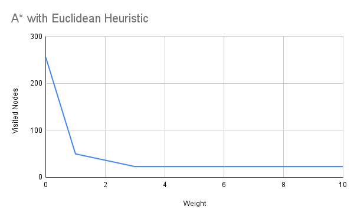
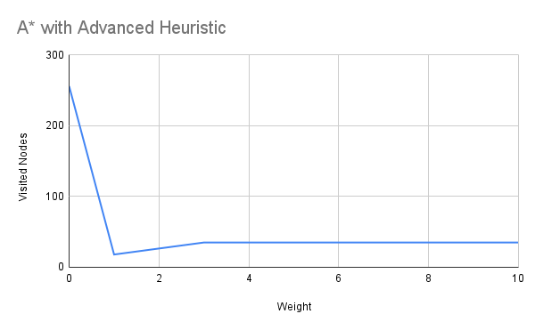
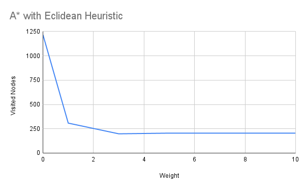
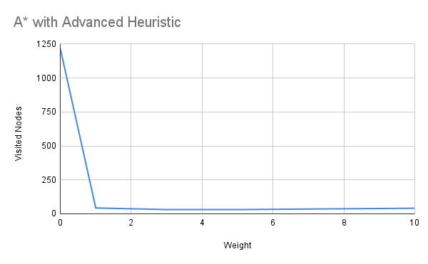
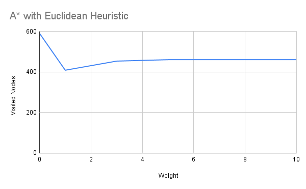
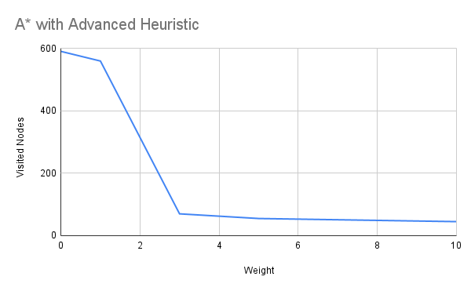
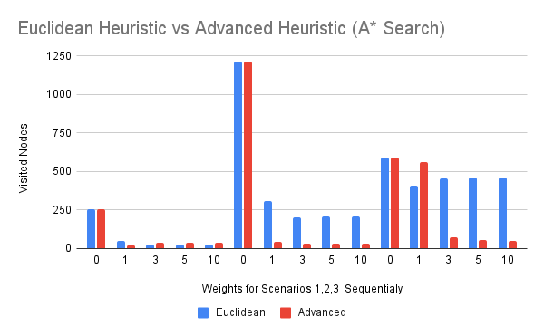
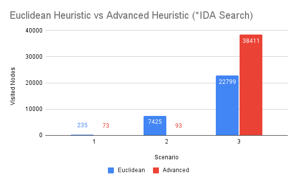

# Artificial Intelligence - 1st Assignment

This repository focuses on pathfinding for a car in various scenarios. The solution is calculated offline and then executed. We utilized the **Weighted A*** and **Iterative Deepening A*** algorithms, exploring different heuristic approaches to guide the search.

---

## General Overview

The core task involved finding an optimal path for a car to reach a designated target. Our approach involved implementing and experimenting with two key pathfinding algorithms: **Weighted A*** and **Iterative Deepening A***. The heuristics used to guide these algorithms were initially based on **Euclidean distance** and were progressively refined to incorporate additional problem parameters. We also conducted experiments to analyze the impact of the heuristic's weight in the Weighted A* algorithm, as well as the individual weights of different components within the improved heuristic.

---

## Weighted A*

The Weighted A* algorithm is implemented in `Algorithms/AStar.py`. Its construction involves an iterative process for adding child nodes to the **fringe**, and the **sorted fringe** allows us to expand the child with the lowest cost. The cost is defined by the following equation:

$f(x) = g(x) + w*h(x)$

where:
* $x$ is the current node.
* $g(x)$ is the cost function (actual cost from the start node to $x$).
* $h(x)$ is the heuristic function (estimated cost from $x$ to the target).
* $w$ is the weight given to the heuristic, balancing its influence against the actual cost.

The performance of the Weighted A* algorithm is highly dependent on the accuracy and guidance provided by the heuristic.

### Heuristic - Euclidean Distance

Our initial heuristic was based on the **Euclidean distance** between the car's current position and the goal. This simple metric provides an indication of proximity to the solution. The Euclidean distance is calculated as:

$dist=\sqrt{(x_{current}-x_{goal})^2 + (y_{current}-y_{goal})^2}$

Adding this value to the cost function helps prioritize nodes that reduce this distance. To emphasize the heuristic's influence, we can multiply $h(x)$ by a positive integer $w$. We analyzed the algorithm's performance for various values of $w$.

### Heuristic - Advanced

While Euclidean distance serves as a decent measure, it has room for improvement. Our **advanced heuristic** also incorporates Euclidean distance but considers additional factors. We explored ideas such as adjusting distance calculations based on the car's movement characteristics (e.g., easier movement along the x-axis vs. y-axis), aiming to align the car with the target efficiently.

A significant improvement involved penalizing movements that overshoot the target on the x-axis. This mechanism, represented as `dist_after_goal` in our mathematical model, significantly increases the cost of such steps when activated.

Furthermore, we considered the car's distance from obstacles (other cars). The `get_obstacle_info()` function provides obstacle locations. We aimed to calculate the distance to a safe point where the car could bypass an obstacle on the x-axis. This was categorized based on the car's vertical position relative to the obstacle:

* **Car above the obstacle:** The upper-left corner of the obstacle was considered a permissible trajectory point.
* **Car below the obstacle:** The lower-left corner of the obstacle was considered a permissible trajectory point.
* **Car at the obstacle's height:** The left corner of the obstacle closer to the car (either upper or lower left) was chosen.

This `dist_to_obs` metric guides the heuristic to solve the subproblem of safely navigating past obstacles.

The complete advanced heuristic $h(x)$ is calculated using the following formula, incorporating individual weights for each component:

$h(x) = w_1*eucl\_dist+w_2*dist\_after\_goal+w_3*dist\_to\_obs$

The performance of the algorithms with varying $w_i$ values is detailed in the results section.

---

## Iterative Deepening A*

The **Iterative Deepening A*** algorithm is implemented as a recursive search. The termination condition is reaching the target. If the target is not reached, the search continues, and the cost threshold for the algorithm is increased. This algorithm uses the same heuristics mentioned above, with the heuristic being weighted as 1 in the $f(x)$ calculation.

---

## Results

### General Findings

For the **A*** algorithm, when the heuristic weight ($w$) is 0, it essentially behaves as a Breadth-First Search (BFS) since it lacks heuristic guidance and expands all possible nodes at each depth.

For the **Advanced Heuristic**, the empirically determined individual weights that provided optimal performance were:

* **A***: $w1=0.1\ \ w2=100 \ \ w3=0.9$
* **IDA***: $w1=\frac{2}{3}\ \ w2=100 \ \ w3=\frac{1}{3}$

It's logical that these weights increase the overall heuristic value. The very high value for $w2$ is due to its function as a penalty, activating only when the car overshoots the target on the x-axis.

### Scenario 1 Results

#### Euclidean Heuristic

With the **Euclidean heuristic**, the number of steps was significantly higher due to the limited information provided. For the A* algorithm, performance (measured in visited nodes) improved as the heuristic weight increased. However, beyond a weight of 10, no further performance difference was observed for any scenario. Specifically, the number of visited nodes remained constant for $w \geq 3$.

The performance of the A* algorithm is shown below:

  

For the IDA* algorithm with the Euclidean heuristic (using $w=1$), the number of steps was also elevated compared to the advanced heuristic. The algorithm visited **235 nodes** to reach the target.

#### Advanced Heuristic

The final performance of the A* algorithm with the **Advanced Heuristic** is shown below:

  

The IDA* algorithm visited **73 nodes**.

### Scenario 2 Results

#### Euclidean Heuristic

The performance of the A* algorithm with the **Euclidean Heuristic** is shown below:

  

It is observed that for $w \geq 5$, the number of visited nodes does not change.

The IDA* algorithm visited **7425 nodes**. The increased number of nodes compared to A* is due to IDA*'s nature of not retaining information between iterations. Each time the cost threshold increases, the algorithm restarts and revisits nodes. Therefore, the count of "Visited Nodes" reflects cumulative visits rather than unique nodes.

#### Advanced Heuristic

The performance of the A* algorithm with the **Advanced Heuristic** is shown below:

  

The IDA* algorithm visited **93 nodes**.

### Scenario 3 Results

In this scenario, there are two obstacles extending towards the edges of the movement field.

#### Euclidean Heuristic

The performance of the A* algorithm with the **Euclidean Heuristic** is shown below:

  

It is observed that for $w \geq 5$, the number of visited nodes does not change.

The IDA* algorithm visited **22799 nodes**, highlighting the critical importance of a good heuristic for this algorithm.

#### Advanced Heuristic

The performance of the A* algorithm with the **Advanced Heuristic** is shown below:

  

The IDA* algorithm visited **38411 nodes**.

### Heuristic Comparison

The performance comparison of the two heuristics for **A*** is:

  

We observe that our custom-designed heuristic generally outperforms the Euclidean heuristic across most scenarios, with the performance difference widening as the heuristic's weight increases. As expected, when the weight is 0, both heuristics yield the same performance.

The performance comparison of the two heuristics for **IDA*** is:

  

For IDA*, our heuristic shows significantly better results in the first two scenarios, but not in the third.

---

## Conclusions

Generally, the **A*** algorithm is known for its high **space complexity**, mainly due to the need to store a significant number of nodes in the fringe (all children of visited nodes are stored). In the case of **Iterative Deepening A***, this problem is mitigated as it expands each "promising" path up to a cost limit, incrementally increasing this limit until the target is found.

The **time complexity** is similar for both algorithms, with IDA* being slightly slower because it restarts its search from the beginning each time it exceeds the cost threshold. It's crucial to note that the **heuristic function** plays a major role in both time and space complexity. This is because the heuristic function influences the estimated cost of each node. If this cost accurately reflects the problem's solution, it significantly reduces the exploration of nodes that ultimately won't be part of the final path.

---

## Execution Instructions

The code is configured to run by default using the **advanced heuristic**. If you wish to switch to the **Euclidean heuristic**, you need to comment/uncomment the relevant sections in the `evaluation_function()` of both algorithms, as well as the appropriate print statements for the cost in `main.py`.

After execution, the program generates a file named `output.txt` containing the desired output and also displays it in the console. The submitted folder includes `output1.txt` and `output2.txt`, which contain the program's output for the Euclidean and advanced heuristics, respectively.
